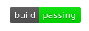

# Travis Builder
  [](https://www.gnu.org/licenses/gpl-3.0) [](https://shields.io/) [](https://GitHub.com/Naereen/StrapDown.js/graphs/commit-activity)

Travis Builder is a basic library to make things easier while working with Travis build system.
So let's start first showing you how to add a travis badge to your project. Add the text below to your md file: 
```

```
Then open Travis [web page](https://travis-ci.org/) and synchronise you Github account.
After that compile travis.test file in the location which you create your project. Then run compiled file with one argument which is the name of your project in Github(__in URL link__).
Running your program in command line would seem like below:
```
~your_project_directory$ ./travis.test project-name
```
That's it. Now you will see a bunch of file in your project folder. Your project structure must be like:
```
-my-project
    -lib
        -lib.h
    -test
        -lib.test.c
    -other github files(like licence, readme, etc.)
    -travis.test (compiled file) is started here too
```
So after all this work go to Travis web page. Choose your project. Lastly start build. Wow you really get there:)<br><br>
<p align="center">

</p>

## Licence 
Saber is [GNU Licensed.](https://github.com/ThankfulBird/ctring/blob/master/LICENSE)
